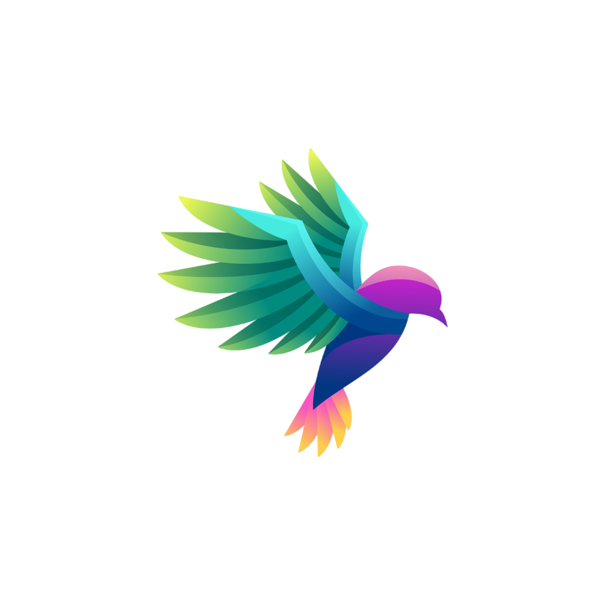
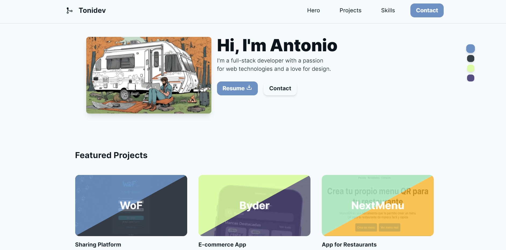
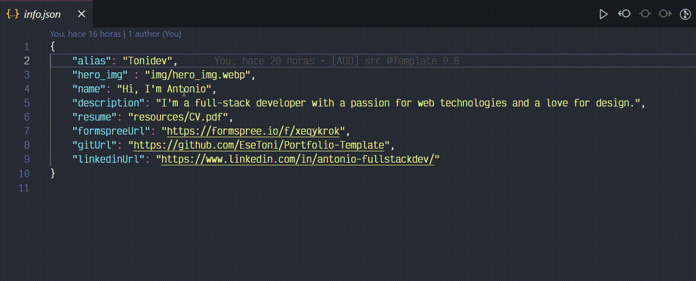

<div align="center">
 
        
<h2>
    <em>Portfolio</em> minimalista para desarrolladores
</h2>
</a>
<p>
  <em>
    Sencillo de usar con .json, de <strong>codigo abierto</strong>
  </em></p>
</p>


<p>
  <em>
    Para toda la comunidad se aceptan : <strong>pull requets</strong>
  </em>

</p>

</div>

<div align="center">
    <a href="#-empezar">
        Empezar
    </a>
    <span>&nbsp;✦&nbsp;</span>
    <a href="#comandos">
        Comandos
    </a>
    <span>&nbsp;✦&nbsp;</span>
    <a href="#licencia">
        Licencia
    </a>
    <span>&nbsp;✦&nbsp;</span>
    <a href="https://portfolio-tonidev.netlify.app/">
        Personal
    </a>
   
</div>

<p></p>

<div align="center">


</div>
    <a href="https://portfolio-tonidev.netlify.app/" target="_blank">
</img>
    </a>

## 🛠️ Stack

- [**Astro**](https://astro.build/) - Framework principal para generar pagina estatica.
- [**Preact**](https://preactjs.com/) - Construir islas dinamicas poco pesadas.
- [**Typescript**](https://www.typescriptlang.org/) y [**Tailwind**](https://www.typescriptlang.org/)  - Aceleradores de desarollo.


## 🚀-Empezar

### 1. Usa este [repo](https://github.com/EseToni/Portfolio-Template/) como _template_ para tu Portfolio.


- Yo uso [npm](https://www.npmjs.com/) como gestor de dependencias y empaquetador.

```bash
# Clona el proyecto
git clone https://github.com/EseToni/Portfolio-Template.git
# Instala las dependencias
npm install
```

### 2. Añade tu contenido:
Edita la información de los archivos __.json__ que se encuentran en la ruta [__data/__](mad-main/src/data/) `*.json` para crear tu propio Portafolio.




### 3. Añadiendo img - icons:
Añade en [__public/__](mad-main/public/)`img` \\ `icons` las imagenes y los iconos y asegurate que su nombre coincidan con los `.json` de [__@data__](mad-main/src/data/)

### 3. Lanza el servidor de desarrollo:

```bash
# Disfruta del resultado
npm run dev
```


1. Abre [**http://localhost:4321**](http://localhost:4321/) en tu navegador para ver el resultado 🚀


## 🧞 Comandos 

|     | Comando          | Acción                                        |
| :-- | :--------------- | :-------------------------------------------- |
| ⚙️  | `dev` o `start` | Lanza un servidor de desarrollo local en  `localhost:4321`.  |
| ⚙️  | `build`          | Comprueba posibles errores y hace un empaquetado de producción en `./dist/`.      |
| ⚙️  | `preview`        | Vista previa en local `localhost:4321` |


## 🔑 Licencia

[MIT](LICENSE.txt) - Creado por [**tonidev**](https://github.com/EseToni/).

## 🫂 Contribuidores

<a href="https://github.com/EseToni/Portfolio-Template/graphs/contributors">
  
</a>

<p></p>


